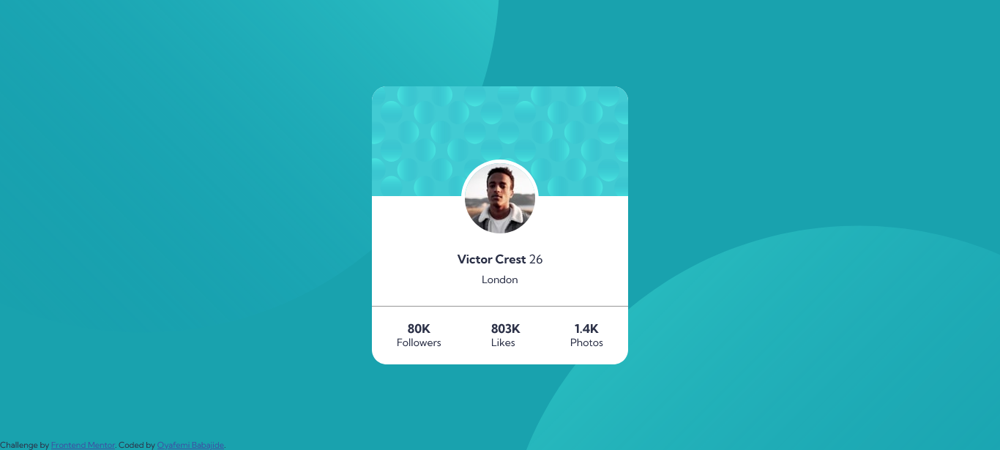
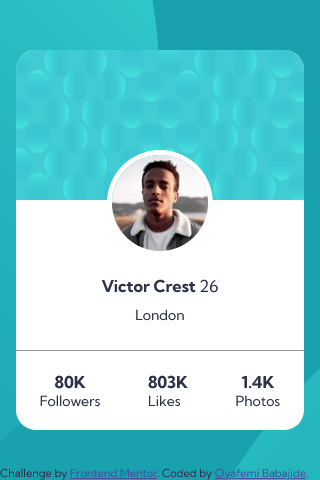

# Frontend Mentor - Profile card component solution

This is a solution to the [Profile card component challenge on Frontend Mentor](https://www.frontendmentor.io/challenges/profile-card-component-cfArpWshJ). Frontend Mentor challenges help you improve your coding skills by building realistic projects.

## Table of contents

- [The challenge](#the-challenge)
- [Screenshot](#screenshot)
- [Links](#links)
- [Built with](#built-with)
- [Author](#author)

## Overview

### The challenge

- Build out the project to the designs provided

### Screenshot

### Links

- Solution URL: [Click here](https://github.com/Babajide777/profile-card-component)
- Live Site URL: [Click here](https://babajide777.github.io/profile-card-component/)

### Built with

- Semantic HTML5 markup
- CSS custom properties
- Flexbox
- CSS Grid
- Mobile-first workflow

## Author

- Website - [Oyafemi Babajide](https://babajide-portfolio.netlify.app/)
- Frontend Mentor - [Babajide777](https://www.frontendmentor.io/profile/Babajide777)
- Twitter - [@jid_Boss](https://www.twitter.com/jid_Boss)
